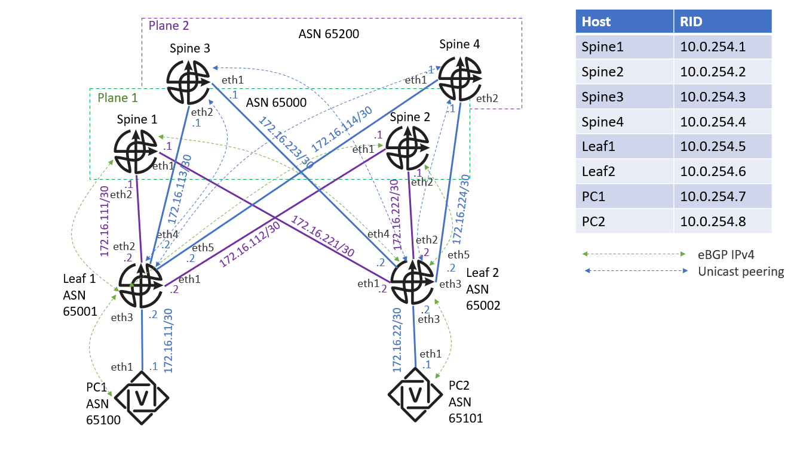

# BGP

Как и во всех задачах по маршрутизации, код агента конфигурации находится в файле `main.py`. Ваша задача — завершить его реализацию.

Во всех задачах можно предполагать, что интерфейсы, описанные в топологии, уже существуют, но никакая маршрутизация предварительно настроена не была.

## О среде

Как и в задаче про ISIS, мы будем использовать [FRR (FRRouting)](https://docs.frrouting.org/en/stable-10.2/about.html).

Основным способом конфигурирования FRR является [VTY shell](https://docs.frrouting.org/en/stable-10.2/vtysh.html). Авторское решение использует утилиту `vtysh` в качестве основного инструмента конфигурации. Мы рекомендуем написать свой удобный враппер для `vtysh`, который может пригодиться в следующей задаче.

## Топология сети

## Тестирование

Как и в задачах по статической маршрутизации, тесты проверяют только связность сети. Формально ничто не мешает вам сдать решение, не использующее BGP, однако такие решения будут проигнорированы в конце семестра.
