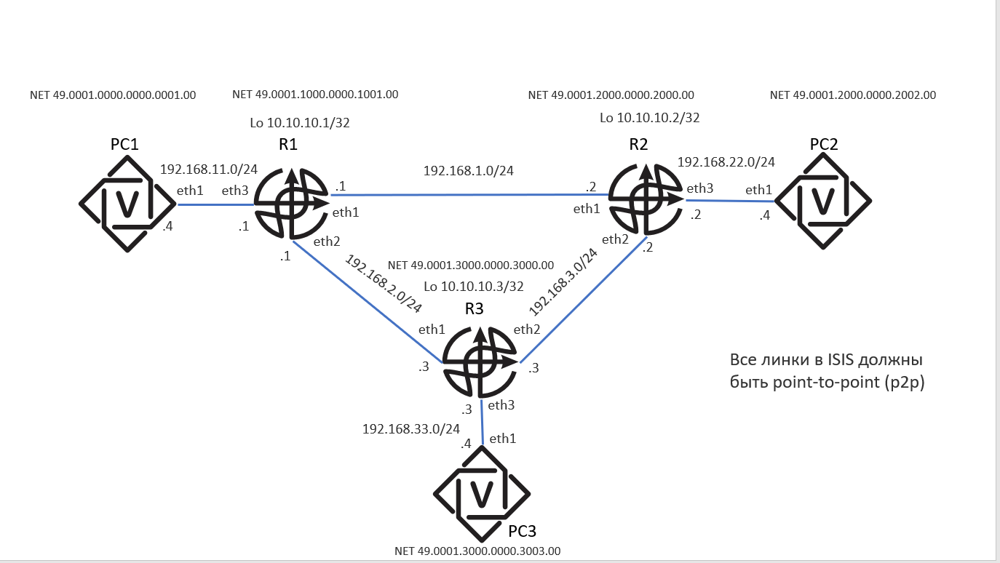

# ISIS

Как и во всех задачах по маршрутизации, код агента конфигурации находится в файле `main.py`. Ваша задача — завершить его реализацию.

Во всех задачах можно предполагать, что интерфейсы, описанные в топологии, уже существуют, но никакая маршрутизация предварительно настроена не была.

## О среде

В этой задаче мы будем использовать [FRR (FRRouting)](https://docs.frrouting.org/en/stable-10.2/about.html) — набор демонов и утилит, позволяющий настраивать маршрутизацию на хосте с помощью различных протоколов. В данной задаче необходимо использовать протокол ISIS.

Основным способом конфигурирования FRR является [VTY shell](https://docs.frrouting.org/en/stable-10.2/vtysh.html). Авторское решение использует утилиту `vtysh` в качестве основного инструмента конфигурации. Мы рекомендуем написать свой удобный враппер для `vtysh`, который может пригодиться в следующей задаче.

## Топология сети

## Тестирование

Как и в задачах по статической маршрутизации, тесты проверяют только связность сети. Формально ничто не мешает вам сдать решение, не использующее ISIS, однако такие решения будут проигнорированы в конце семестра. Если в вашем решении отсутвует использование `ip route add` и аналогов, то скорее всего с вашим решением все хорошо.

Сходимость маршрутов в ISIS занимает некоторое время. По умолчанию на данной топологии маршруты сходятся примерно за 30 секунд. Однако ожидание 30 секунд в каждом тесте создаст ненужную нагрузку на тестирующую систему.

Авторское решение использует [настройки таймеров](https://docs.frrouting.org/en/latest/isisd.html#isis-timer) `lsp-gen-interval 1`, `lsp-refresh-interval 2`, `spf-interval 2`. При таких настройках маршруты распространяются менее чем за 5 секунд.
