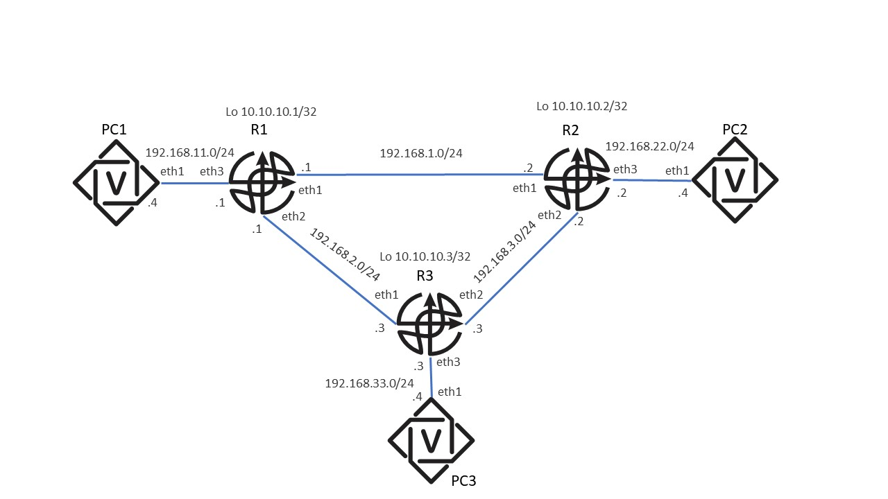

# Статическая маршрутизация

Это первая задача на роутинг. Все задачи на роутинг будут устроены похожим образом - ваша задача
написать агент конфигурации для хостов в сети. Агент конфигурации будет запущен на каждом хосте и
должен привести хост в нужное.

Шаблон кода агента находится в файле `main.py`, ваша задача его закончить его имплементацию.

Во всех задачах можно предполагать, что интерфейсы описанные в топологии уже существуют, но никакая маршрутизация настроена не была.

## Топология сети



## Желаемое состояние

Ваша задача настроить роутинг так, чтобы была связность между любым хостом и интерфейсом на любом другом хосте.

Тесты будут проверить, что с любого хоста все интерфейсы пингуются.

## Подсказки

Задача очень простая.
Агент должен выполнить несколько вызовов команд, `ip address add` и `ip route` на каждом хосте.

Прочитайте мануал по этой утилите [например этот](https://man.archlinux.org/man/ip-route.8.en).

Чтобы пинг проходил, нужно чтобы маршрутизация была настроена в обе стороны.
Команда `ip route show to match ваш_адрес` поможет понять, как бы пакет с адресом получателя маршрутизируется на хосте.

## Как отлаживаться

Чтобы заустить тесты локально, можно воспользоваться `run-grader-localy.sh`. Строка запуска `TASK_NAME=static_routing run-grader-localy.sh`.
В этой задаче и всех задачах с containerlab, контейнеры не будут выключены после завершения последнего теста, это дает возможность зайти в контейнер, например, `docker exec -it clab-static_routingtest-user-12345-R3 bash` и руками запустить `ping`, `traceroute`, `ip route show` и тд.

Второй способ, это локально запустить [containerlab](https://containerlab.dev/) топологию, настроить хосты внутри этой топологии вашим агентом и проверить, что связность имеется.

Может быть полезно попробовать сначала настроить пару хостов руками, и только после этого писать кода агента. Проще всего настроить свяность можду `PC1` и `R1`.

Если в строчке лога есть перевод строки, Gitlab CI иногда показывает только часть лога после последнего первода строки, запустить локально
или посмотреть в raw лог в UI Gitlab решает проблему.


### Запустить docker с containerlab

```
export CONTAINERLAB_IMAGE_TAG = "gitlab.manytask.org:5050/computer-networks/public-2025-spring/containerlab:latest"
docker run -it --rm --privileged \
    --network host \
    -v /var/run/docker.sock:/var/run/docker.sock \
    -v /var/run/netns:/var/run/netns \
    -v /etc/hosts:/etc/hosts \
    -v /var/lib/docker/containers:/var/lib/docker/containers \
    --pid="host" \
    -v "${PWD}:/repo" \
    ${CONTAINERLAB_IMAGE_TAG} bash
```

Если запустить эту комагду из корня репозитория, то согласно `-v "${PWD}:/repo" \`, в дирректорию `/repo` внутри контейнера замаунтится корень репозитория.

Чтобы запустить топологию, внтури дирректории с задчей запустите `containerlab deploy -t lab.yml`, где `lab.yml` имя топологии.
Чтобы остановить все контейнеры в топологии `containerlab destroy -t static_routing/lab.yml -c`

После этого можно руками запустить вашего агента на каждом хосте и посмотреть проверить, что сеть работает.


