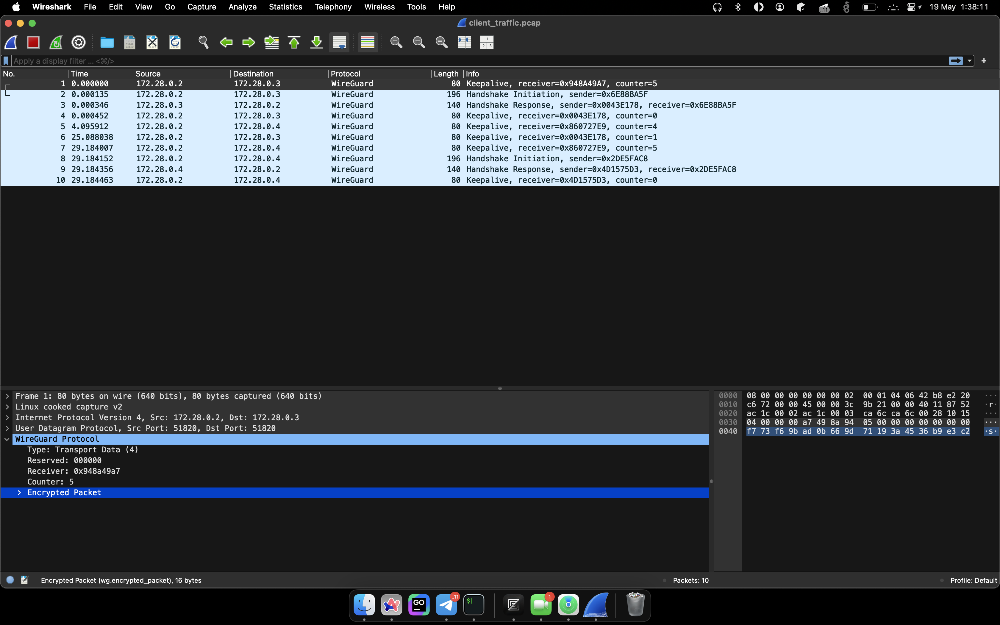
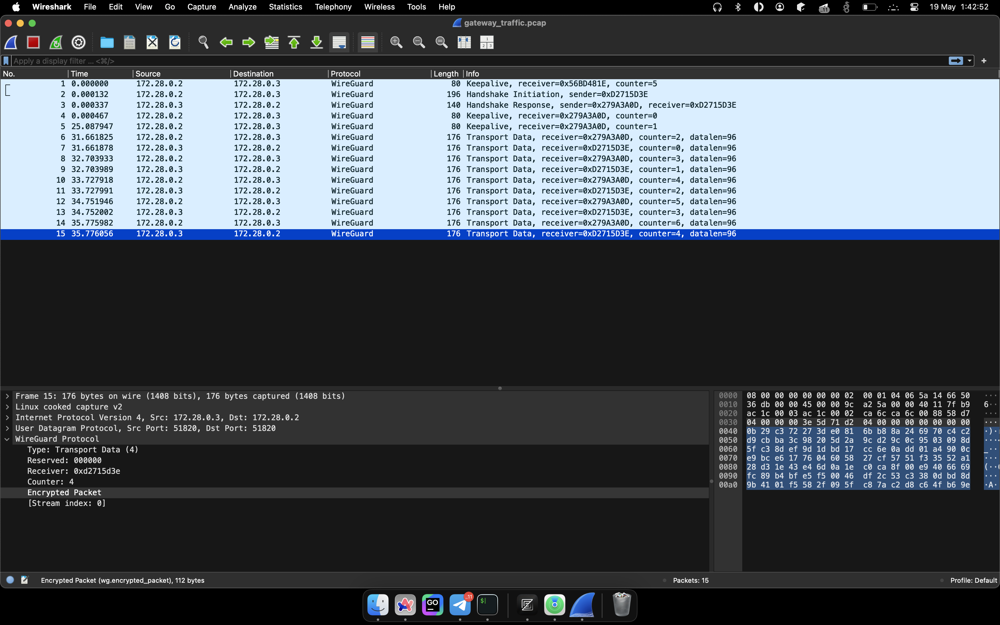

## WireGuard Setup

WireGuard Client, Gateway and External Gateway поднимаются в отдельных Docker контейнерах в общей сети.
Каждый из контейнеров представляет из себя образ [https://hub.docker.com/r/linuxserver/wireguard](https://hub.docker.com/r/linuxserver/wireguard) с предустановленным WireGuard.

Для сборки образа необходимо выполнить команду:

```sh
make build-image
```

Для запуска контейнеров необходимо выполнить команду:

```sh
docker compose up
```

При старте контейнера автоматически регистрируются все интерфейсы, на основании переданных в volume конфигурационных файлов.
Вызванные команды можно посмотреть в логах контейнера.

```sh
docker logs wireguard-client
```

```txt
**** Found WG conf /config/wg_confs/wg0.conf, adding to list ****
**** Found WG conf /config/wg_confs/wg1.conf, adding to list ****
**** Activating tunnel /config/wg_confs/wg0.conf ****
Warning: `/config/wg_confs/wg0.conf' is world accessible
[#] ip link add wg0 type wireguard
[#] wg setconf wg0 /dev/fd/63
[#] ip -4 address add 10.10.0.2/24 dev wg0
[#] ip link set mtu 1420 up dev wg0
**** Activating tunnel /config/wg_confs/wg1.conf ****
Warning: `/config/wg_confs/wg1.conf' is world accessible
[#] ip link add wg1 type wireguard
[#] wg setconf wg1 /dev/fd/63
[#] ip -4 address add 10.20.0.2/24 dev wg1
[#] ip link set mtu 1420 up dev wg1
```

## Key Generation

```sh
wg genkey > private
wg pubkey < private > public
wg genpsk > psk
```

| name    | private key                                    | public key                                     | psk                                            |
| ------- | ---------------------------------------------- | ---------------------------------------------- | ---------------------------------------------- |
| client1 | `iOW2MtnWbLdbhaOUElw1PR2g6pkNhdIE9uP7w5f6Pls=` | `nvIYhzSsSlocyQjWdw/Ehku6fHFIDxbhLH1B0H9OV3Y=` |                                                |
| client2 | `aHNSYtIuy4H7XUYli8eZrink/RZZSfUEHR3m7q6mmmE=` | `xU/nDbCirmxUrPamO6OXeGl9D/KJ3lrLRmvmwPh9VXU=` |                                                |
| gw      | `4OeUh0ONgupt/Fwhw2/YIPq+uViUEbzOTL9wokg0LFY=` | `TMPxmxlpT9qX75i+kOUVdDaOhWkduKn7AUY3nn8gfEY=` |                                                |
| egw     | `cHT3xXSryJkS1FPFVEU2MFXsBWqlDCiLODeJvRYtsG4=` | `xwGKECpEYVhX2nx/Ezare/m8mbfVOjBeTW1wFMef9yQ=` | `xyqOa5noRebXRbA7wgR+4Mw15uO94e/6TqS2ozTUmco=` |

## Checking WireGuard Status

```sh
docker exec -it wireguard-client wg show
```

```txt
interface: wg0
  public key: nvIYhzSsSlocyQjWdw/Ehku6fHFIDxbhLH1B0H9OV3Y=
  private key: (hidden)
  listening port: 51820

peer: TMPxmxlpT9qX75i+kOUVdDaOhWkduKn7AUY3nn8gfEY=
  endpoint: 172.28.0.3:51820
  allowed ips: 10.10.0.0/24
  latest handshake: 1 minute, 27 seconds ago
  transfer: 12.40 KiB received, 45.90 KiB sent
  persistent keepalive: every 25 seconds

interface: wg1
  public key: xU/nDbCirmxUrPamO6OXeGl9D/KJ3lrLRmvmwPh9VXU=
  private key: (hidden)
  listening port: 51821

peer: xwGKECpEYVhX2nx/Ezare/m8mbfVOjBeTW1wFMef9yQ=
  preshared key: (hidden)
  endpoint: 172.28.0.4:51820
  allowed ips: 10.20.0.0/24
  latest handshake: 58 seconds ago
  transfer: 13.40 KiB received, 46.79 KiB sent
  persistent keepalive: every 25 seconds
```

## Handshake, Ping, Tcpdump

Для того, чтобы проанализировать трафик воспользуемся `tcpdump` и `ping`.

```sh
tcpdump -i any udp port 51820 or port 51821 -vvv -w traffic.pcap
```

Из wireguard-client:

```sh
ping 10.10.0.3
ping 10.20.0.4
```

Какие-то примерчики:



